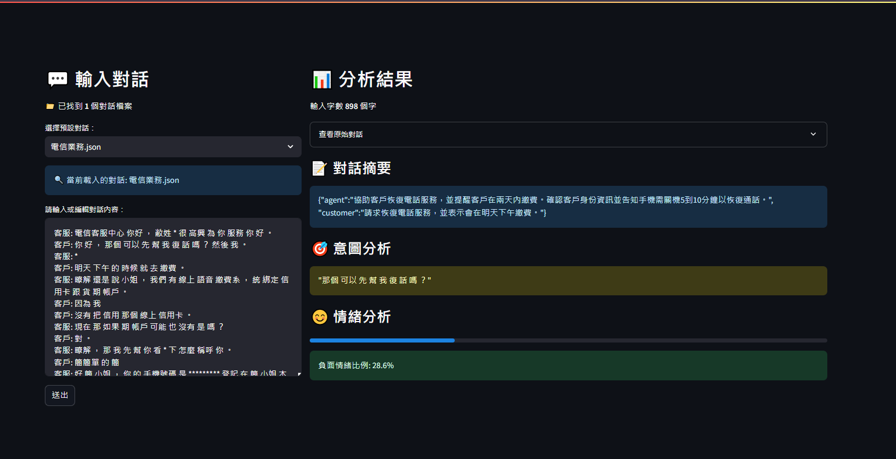
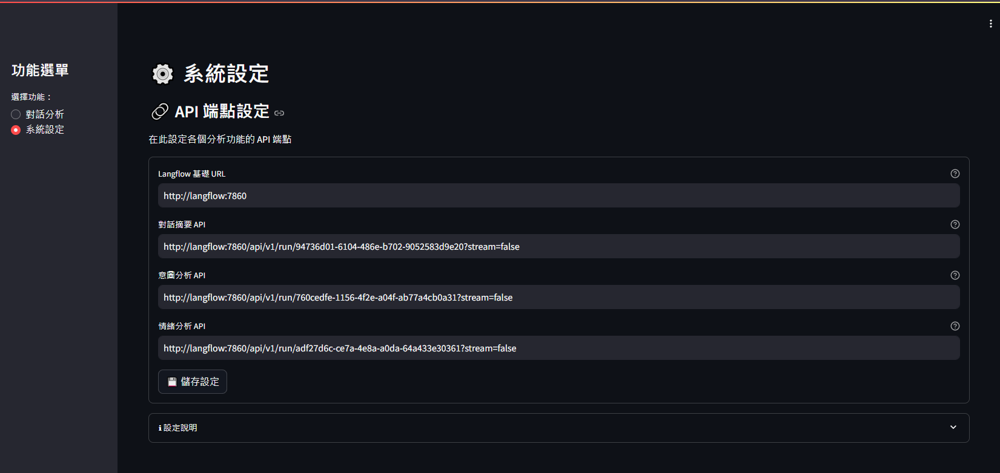

# **Streamlit Text Analysis Using LangFlow**

## **📌 專案簡介**
這是一個使用 **Streamlit** 開發的 **對話分析應用**，並使用 **LangFlow API** 進行 **對話分析與情緒分析**。應用已經 **Docker 容器化**，可以快速部署。

## **⚡ 功能特色**
✅ 使用 **Streamlit** 建立互動式對話介面  
✅ 透過 **LangFlow API** 進行對話分析  
✅ 支援對話情緒分析功能  
✅ **Docker 容器化**，可跨平台部署  
✅ **Docker Compose** 支援，方便管理  

## 系統介面與分析結果(介接LangFlow對話摘要)


## LangFlow流程設計範例


---
## **📂 專案目錄結構**
```
textanalysis_langflow/
│── app.py                 # Streamlit 應用主程式
│── requirements.txt       # Python 依賴套件
│── Dockerfile             # Docker 映像檔配置
│── docker-compose.yml     # Docker Compose 配置
│── README.md             # 專案說明文件
│── setup_flow.sh         # 流程設定腳本
│── get_flow_id.py        # 流程 ID 獲取工具
│── import_flow.py        # 流程導入工具
│── images/               # 系統範例截圖
│── flows/                # LangFlow 流程定義
│   └── Emotion.json     # 情緒分析流程
│── env/                 # 環境配置目錄
│   ├── network.env      # 網路環境配置
│   └── app.env         # 應用程式環境配置
│── langflow-data/       # LangFlow 數據存儲
└── langflow-postgres/   # PostgreSQL 數據目錄
```

---
## **🚀 快速開始**

### **1️⃣ 使用 Docker Compose 部署（推薦）**

1. **建置和啟動服務**：
   ```bash
   docker-compose build
   docker-compose up -d
   ```

2. **設定 LangFlow 流程**：
   ```bash
   ./setup_flow.sh
   ```
   此腳本會：
   - 等待服務完全啟動
   - 導入情緒分析流程
   - 獲取流程 ID
   - 顯示設定說明

3. **更新流程 ID**：
   使用上一步獲取的流程 ID 更新 `env/app.env` 中的 URL。

4. **重新啟動應用**：
   ```bash
   docker-compose restart analysis_app
   ```

應用將在 **http://localhost:8501** 運行。

### **2️⃣ 本機開發模式**
如果你想在本機運行，請確保已安裝 Python 3，並執行：
```bash
pip install -r requirements.txt
```

啟動 Streamlit 應用：
```bash
streamlit run app.py
```

---
## **💡 常見問題**

### API 連接錯誤
如果遇到 API 連接錯誤，請確保：
1. 所有服務都已正常啟動
2. 已正確執行 setup_flow.sh 並更新流程 ID
3. env/app.env 中的 URL 設定正確

### 流程 ID 更新
如果需要重新獲取流程 ID：
```bash
docker-compose run --rm -v $(pwd)/get_flow_id.py:/app/get_flow_id.py analysis_app python /app/get_flow_id.py
```

---
## **⚙️ 技術棧**
- **Streamlit** - 建立 Web 應用
- **LangFlow** - 對話分析與情緒分析
- **Docker** - 容器化應用
- **PostgreSQL** - 數據持久化存儲

---
## **📜 版權 & 授權**
本專案以 **MIT License** 授權，你可以自由修改、分發，但請註明來源。

🚀 **歡迎貢獻！有任何問題，請提交 Issue 或 PR！**
